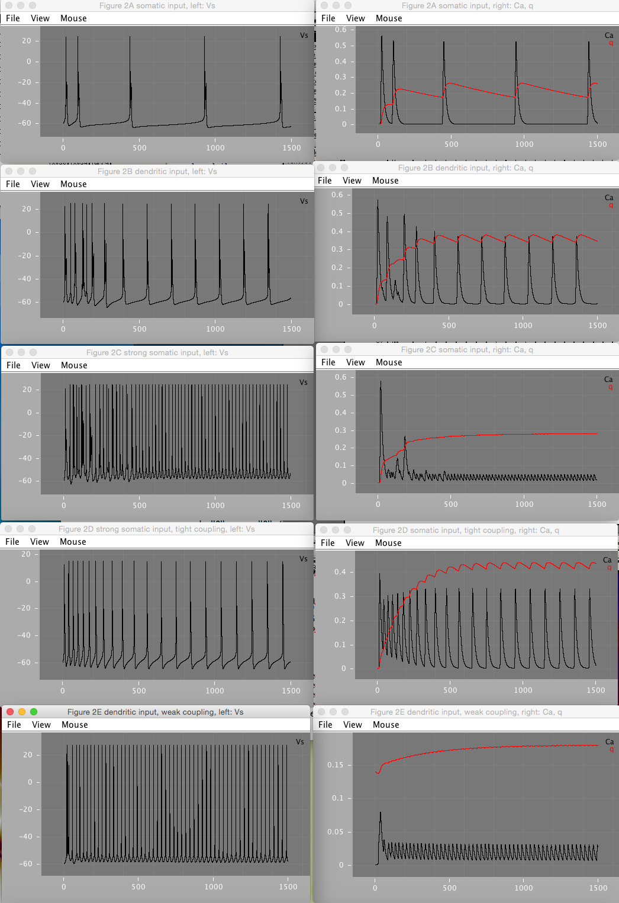
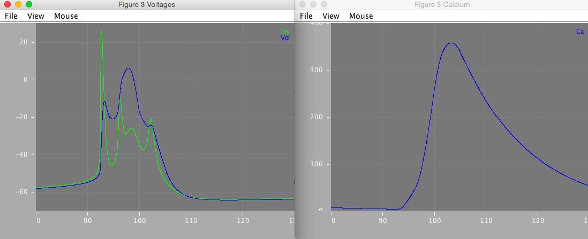

PinskyRinzelModel
=================

Reduced CA3 cell model from Pinsky & Rinzel 1994

See http://www.opensourcebrain.org/projects/pinskyrinzelmodel
and https://github.com/OpenSourceBrain/Contribute/issues/2

Reproduced Figures 2 & 3 using LEMS
========================
Figure 2
--------

Figure 3
--------

Issues
========================
Figure 2B
---------
Figure 2B is mostly reproducible. gnmda parameter (2nd of the triple in figure caption) appears to be mislabeled, and seems to be closer to Id(endrite) than gnmda. Varying gnmda parameter has no effect on the Vs, Ca, or q variables depicted in the figures. Varying Id, results in a closer match, and is also more consistent with the written description of dendritic stimuation mentioned in the figure. Varying Id, the closest match to 2B as depicted in the figure occurs when Id = 2.0 mA.

Figure 2E
---------
Figure 2E is reproducible only partially. Assuming gnmda refers to Id (see above figure 2B issue), and varying Id values, the closest match occurs around Id = 2.0 mA. Furthermore, initial value of qd = 0.4, as described in the paper, appears to be incorrect. Setting initial value to 0.14 results in a closer match. The paper describes that figure 2E spiking pattern was a periodic pattern of a burst followed by a spike. However, no combination of values of gc, Id, Is, gnmda, or initial qd was found to reproduce this pattern in XPP or LEMS. Furthermore, at Is=-0.5, Id=2, and varying gc around 1.425 (as mentioned in paper), the spiking pattern becomes very sensitive to small changes in gc. Because the paper describes a chaotic pattern, the spikes are very sensitive to the value of gc, and several parameter values appear to be incorrect, it's possible the reported figure is unreproducible without additional or existing paremeters being specified more precisely.

Synaptic Dynamics
==================
Missing synaptic currents (added)
-------------------------
The XPP [.ode file](XPP/booth_bose.ode) for this model [obtained from ModelDB](https://senselab.med.yale.edu/ModelDB/ShowModel.cshtml?model=35358&file=\b04feb12\booth_bose.ode) does not include synaptic dynamics. Specifically, Idendrite, Isynapse, Inmda, and Iampa currents are not included. Description on ModelDB mentions that Victoria Booth may have additional details. We emailed her to see if we can get additional files.

New .ode file incorporating the previously missing currents [can be found here](XPP/booth_bose_syn.ode).

Files from Victoria
-----------------
She replied with email below and we include the [files she attached](XPP/Victoria Booth code).

Hi Sharon and Padraig,

I found a couple different xpp files.

I think the model on ModelDB by Bill Lytton is based on xpp files for a network of 2 coupled PR cells with interneurons that was in the attached paper BoothBose-Network2002.  This is the ode file booth_bose_pinrin.ode and the set files network*_pinrin.set

I also found xpp files for a single PR cell that we used for the attached chapter on somatic-dendritic  ping-pong bursting that is in the book Bursting: The Genesis of Rhythm in the Nervous System edited by Stephen Coombes and Paul Bresslof.  We made some simplifications to a time constant function in the PR model that are made in the  pinrin_simpletau*.ode files.

I haven't tried to run these files.  Let me know if you run into major problems with them.
Hope that helps!  Feel free to make them publically available.

Regards,

Victoria

References:

* BoothBose 2002: "Burst synchrony patterns in hippocampal pyramidal cell model networks." www.ncbi.nlm.nih.gov/pubmed/12061418
* BoseBooth 2005: "BURSTING IN 2-COMPARTMENT NEURONS: A CASE STUDY OF THE PINSKY-RINZEL MODEL" http://www.worldscientific.com/doi/abs/10.1142/9789812703231_0005
